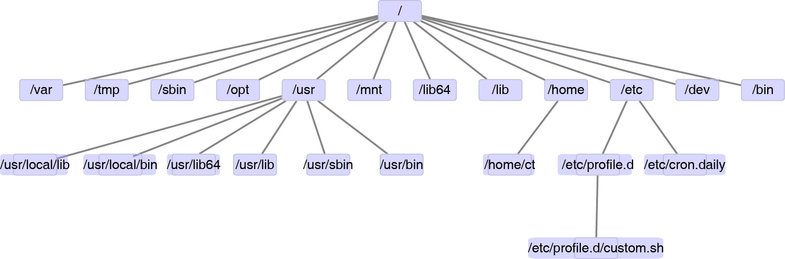

# Linux基础内容 {#linux_basic}

视频课见 <http://bioinfo.ke.qq.com>。

## Linux系统简介和目录理解 {#basicDir}
 
### 为什么要用Linux系统

个人认为，Linux操作系统和类Linux操作系统的命令行界面是最适合进行生物信息分析的操作系统。原因有三点：

* 长期运行的稳定性
* 多数软件只有Linux版本
* 强大的Bash命令简化繁琐的操作，尤其是大大简化重复性工作

但对于初学者来说，接触和理解Linux操作系统需要一些时间和摸索。陡然从可视化点选操作的Windows进入到只有命令行界面的Linux，最大的陌生感是不知道做什么，不知道文件在哪？

我们这篇教程就带大家学习、熟悉、体会Linux系统的使用。

### Linux系统简介

* Linux是一种多用户、多任务的操作系统。最开始是由Linus Torvalds与1991年发布，后由社区维护，产生了不同的分发版。

* 常见版本有`Centos`, `Ubuntu`, `RedHat`, `Debian`等。服务器多用`Centos`系统，免费，稳定，但更新慢。`Ubuntu`系统更新快，注重界面的体验，适合自己笔记本安装。有面向中国的"麒麟"系统。其它两个没用过，`Centos`与`RedHat`, `Debian`与`Ubuntu`同宗，命令行操作起来很相似。

### 如何获取Linux系统

* 如果自己的单位有共有服务器，可以尝试申请账号。
* 自己的电脑安装双系统或虚拟机。
* 使用[gitforwindows](http://blog.csdn.net/woodcorpse/article/details/79313846)在windows下模拟使用Linux命令。
* 购买一块云服务器
* 试验下在线学习平台实验楼 <https://www.shiyanlou.com> (里面也有不少Linux教程，任意点一个进去，双击桌面的`Xfce`图标，都可以启动Linux终端)

### Linux系统登录

登录服务器的IP是：192.168.1.107; 端口是：22；用户名是每个人的姓名全拼，如陈同为chentong (全小写，无空格)；密码是 yishengxin。

```{r, fig.cap="配置Xshell登录服务器1。"}
knitr::include_graphics(c("image/Linux_xshell1.png"))
```

```{r, fig.cap="配置Xshell登录服务器2。"}
knitr::include_graphics(c("image/Linux_xshell2.png"))
```

### 初识Linux系统

既然用Linux，我们就摒弃界面操作，体验其命令行的魅力和庞大。后续操作都是在命令行下进行的，主要靠键盘，少数靠鼠标。

登录Linux系统后，呈现在眼前的是这样一个界面:

```bash
Last login: Mon Jun  5 16:56:56 2017 from 239.241.208.209

Welcome to aliyun Elastic Compute Service!

ct@ehbio:~$ 

```

首先解释下出现的这几个字母和符号:

* `ct`: 用户名
* `ehbio`：如果是登录的远程服务器，则为宿主机的名字；若是本地电脑，则为自己电脑的名字。
* `~`: 代表家目录, 在我们进入新的目录后，这个地方会跟着改变
* `$`: 用来指示普通用户输入命令的地方；对根用户来说一般是`#`
* <http://bashrcgenerator.com/>可视化定制不同的显示方式。
* 个人习惯的展示：`PS1=\[\e]0;\u@\h: \w\a\]${debian_chroot:+($debian_chroot)}\u@\h:\w\$`

### 我的电脑在哪？

打开Windows，首先看到的是桌面；不爱整理文件的我，桌面的东西已经多到需要2个屏幕才能显示的完。另外一个常用的就是我的电脑，然后打开D盘，依次点开对应的文件夹，然后点开文件。

Linux的文件系统组织方式与Windows略有不同，登录进去就是家目录，可视为Windows下的桌面[^Linux的家目录严格来说可能类似于Windows下的`C:\\Users\\ct`]。在这个目录下，我们可以新建文件、新建文件夹，就像在桌面上的操作一样。

而Linux的完整目录结构如下：


```{r, fig.cap="Linux目录层级结构。"}

```

```bash
# 若提示命令找不到，运行下面语句安装tree
# 需要有根用户权限
# yum install tree.x86_64
ct@ehbio:~$ tree -d -L 2 /

```

```{r}
directory = "Path;Description
/;根目录
/bin;常用软件如ls, mkdir, top等的存放地
/dev;硬件相关
/etc;存放系统管理和配置相关文件
/etc/cron*;与定时任务相关的文件夹，可执行程序放置到对应文件夹就可以定时执行
/etc/profile.d;目录下存放Bash相关的配置文件，相当于全局的.bashrc
/etc/profile.d/custom.sh;我在配置全局环境时，一般写入这个文件；如果不存在，可以新建。
/home;家目录，默认新建用户的个人家目录都在此文件夹下
/home/ct;用户名为ct的用户的家目录
/lib -> usr/lib;存放动态库的目录 (library)，安装软件时碰到依赖的动态库一般存储于此
/lib64 -> usr/lib64;64位软件动态库，-> 表示软连接，等同于快捷方式
/mnt;文件系统挂载，一般插入U盘会显示在这。
/opt;部分额外安装的软件会置于此
/root;根用户的家目录
/sbin -> usr/sbin;根用户的管理命令
/tmp;临时目录，会定时清空，常用于存放中间文件
/usr;存放系统应用的目录，前面有几个目录都是该目录下子目录的软链
/usr/bin;大部分应用程序安装于此
/usr/sbin;根用户的管理命令
/usr/lib;存放动态库的目录 (library)，安装软件时碰到依赖的动态库一般存储于此
/usr/lib64;64位软件动态库
/usr/local/bin;存放本地安装的命令
/usr/local/lib;存放本地安装的库
/var;存放各服务的日志文件。若装有网络服务，一般在/var/www/html下。
"

directory = read.table(text=directory, header=T,row.names=NULL,sep=";")

knitr::kable(directory, booktabs=T,caption="Linux下目录简介")
```

作为一个普通用户，通常只在`/home/usr`, `/tmp`下有**可写**的权限，其它目录最多是**可读、可执行**，部分目录连读的权限都没有。这种权限管理方式是Linux能成为真正多用户系统的一个原因。后面我们会讲解如何查看并修改这些权限。

### 硬件信息查看

看完目录结构了，来看一下硬盘有多大，有多少可用空间，只需要运行`df -h`命令。

```bash
ct@ehbio:~$ df -h
Filesystem            Size  Used Avail Use% Mounted on
/dev/sda2             193G   61G  122G  34% /
tmpfs                 127G  344K  127G   1% /dev/shm
/dev/sda1             190M   77M  103M  43% /boot
/dev/mapper/a          37T   12T   25T  32% /ehbio1
/dev/mapper/b          37T   28T  8.8T  76% /ehbio2
/dev/mapper/c          37T   15T   23T  40% /ehbio3
```

除了看硬盘，还想看下CPU、内存、操作系统呢？

```bash
# serverInfo.sh是我写的一个脚本，这个脚本怎么实现的会是一个考核题目。
ct@ehbio:~$ serverInfo.sh
```

```
Hostname is localhost.localdomain,Ip address is 192.168.1.30.

The 64 bit operating system is  CentOS release 6.9 (Final), 
	
Nuclear info is 2.6.32-696.10.1.el6.x86_64.

The CPU is Intel(R) Xeon(R) CPU E9-5799 v2 @ 3.90GHz.

There are 8 physical cpu, each physical cpu has 0 cores, 0 threads.

There are 96 logical cpu.

The memory of this server is 252G.
```

### 目录内容查看

通常登陆后直接进入家目录，下面大部分操作也是在家目录下完成的。如果想查看当前目录下都有什么内容，输入命令 `ls`，回车即可 (ls可以理解为单词list的缩写)。当前目录下什么也没有，所以没有任何输出。

```bash
ct@ehbio:~$ ls

```

如果错把`l`看成了`i`，输入了`is`，则会出现下面的提示`未找到命令`。如果输入的是Linux基本命令，出现这个提示，基本可以判定是命令输入错了，瞪大眼睛仔细看就是了。 **在敲完命令回车后，注意查看终端的输出，以判断是否有问题。**

```bash
ct@ehbio:~$ is
-bash: is: 未找到命令
# 大小写敏感
ct@ehbio:~$ lS
-bash: lS: 未找到命令
```

当前目录下只有一个文件，看不出效果，我们可以新建几个文件和文件夹。

### 新建目录

`mkdir`是新建一个目录 (`m`a`k`e a `dir`ectory)；`data`是目录的名字。
如果目录存在，则会出现提示，"无法创建已存在的目录"。这时可以使用参数`-p`忽略这个错误。

```bash
ct@ehbio:~$ mkdir data
ct@ehbio:~$ ls
data
ct@ehbio:~$ mkdir data
mkdir: 无法创建目录"data" : 文件已存在

# -p: no error if existing, make parent directories as needed
ct@ehbio:~$ mkdir -p data
```

`cat`是一个命令，主要用来查看文件；在这与`<<END`连用用于读入大段数据。输入`cat <<END`之后，回车，会看到终端出现一个大于号，大于号后面可以输入内容，再回车，继续输入内容，直到我们输入`END` (大写的，与上面一致)，输入过程结束，我们输入的内容都显示在了屏幕上。

```bash
ct@ehbio:~$ mkdir data
ct@ehbio:~$ cat <<END
a
bc
END
a
bc
```

如果我们想把这些内容写入文件，就需要使用 `command > filename`格式。

`>`是一个重定向符号，即把前面命令的输出写入到`>`后面的文件中。如下所示，新建了一个`Fasta`格式的文件。

`ls -l`列出文件的详细信息；`-l`表示命令行参数，是程序预留的一些选项，保证在不更改程序的情况下获得更灵活的操作。可使用`man ls`查看`ls`所有的命令行参数, **上下箭头翻页**，按`q`退出查看。(man: manual, 手册)

```bash
ct@ehbio:~$ cat <<END >data/test.fa
>SOX2
ACGTCGGCGGAGGGTGGSCGGGGGGGGAGAGGT
ACGATGAGGAGTAGGAGAGAGGAGG
>OCT4
ACGTAGGATGGAGGAGAGGGAGGGGGGAGGAGAGGAA
AGAGTAGAGAGA
>NANOG
ACGATGCGATGCAGCGTTTTTTTTTGGTTGGATCT
CAGGTAGGAGCGAGGAGGCAGCGGCGGATGCAGGCA
ACGGTAGCGAGTC
>mYC HAHA
ACGGAGCGAGCTAGTGCAGCGAGGAGCTGAGTCGAGC
CAGGACAGGAGCTA
end
END

## 注意命令和参数之间的空格
ct@ehbio:~/data$ ls-l
-bash: ls-l: 未找到命令

ct@ehbio:~$ ls -l
总用量 4
## d: dir; 表示data是个目录
## rwx：表示目录的权限，暂时忽略，或自己在线搜索
drwxrwxr-x 2 ct ct 4096 6月   8 14:52 data

ct@ehbio:~$ ls -l data
总用量 4
## 开头的`-`表示test.fa是个文件
-rw-rw-r-- 1 ct ct 284 6月   8 14:48 test.fa
```

### 访问文件

查看写入的文件的内容，`cat 文件名`；需要注意的是文件所在的目录，默认是当前目录；如下面第一个命令，会提示`cat: test.fa: 没有那个文件或目录`，是因为当前目录下不存在文件`test.fa`。(注意文件末尾的end)


```bash
# 这个应该是最常见的错误之一，程序不可能知道你的输入文件在什么地方，
# 需要人为指定。
# 如果未指定路径，表示当前目录
ct@ehbio:~$ cat test.fa
cat: test.fa: 没有那个文件或目录

ct@ehbio:~$ cat data/test.fa 
>SOX2
ACGTCGGCGGAGGGTGGSCGGGGGGGGAGAGGT
ACGATGAGGAGTAGGAGAGAGGAGG
>OCT4
ACGTAGGATGGAGGAGAGGGAGGGGGGAGGAGAGGAA
AGAGTAGAGAGA
>NANOG
ACGATGCGATGCAGCGTTTTTTTTTGGTTGGATCT
CAGGTAGGAGCGAGGAGGCAGCGGCGGATGCAGGCA
ACGGTAGCGAGTC
>mYC HAHA
ACGGAGCGAGCTAGTGCAGCGAGGAGCTGAGTCGAGC
CAGGACAGGAGCTA
end
```

`test.fa`在目录`data`下，可以先进入`data`目录，然后再查看文件。类比于Windows下先点开一个文件夹，再点开下面的文件。

这个例子中文件`test.fa`在当前目录的子目录`data`里面，在当前目录下直接查看`test.fa`就像在`我的电脑`里面不进入C盘，就像打开`Program file`文件夹。这属于**隔空打牛**的境界，不是一般人能练就的。起码Linux下不可以。

提到目录，Linux下有**绝对路径**和**相对路径**的概念。

* 绝对路径：以`/`开头的路径为绝对路径，如`/home/ct`, `/usr/bin`, `/home/ct/data`等。需要注意的是`~/data`等同于`/home/ct/data`, 多数情况下可以等同于绝对路径，但在一个情况下例外，软件安装时用于`--prefix`后的路径必须是`/`开头的绝对路径。

* 相对路径: 不以`/`和`~`开头的路径都是相对路径，如`data`表示当前目录下的data目录，等同于`./data` (`.`为当前目录), `../data`表示当前目录的上一层目录下的data目录 (`../`表示上层目录)。


`pwd` (print working directory) 获取当前工作目录。

`cd` (change dir)切换目录。若`cd`后没有指定切换到那个目录，则调回家目录。特别地，`cd -`表示返回到最近的`cd`操作前所在目录，相当于回撤到上一个工作目录。

`head`查看文件最开始的几行，默认为10行，可使用`-n 6`指定查看前6行。

```bash
# 记住输出
ct@ehbio:~$ pwd
/home/ct

ct@ehbio:~$ cd data

# 注意输出变化
ct@ehbio:~$ pwd
/home/ct/data
ct@ehbio:~/data$ head -n 6 test.fa 
>SOX2
ACGTCGGCGGAGGGTGGSCGGGGGGGGAGAGGT
ACGATGAGGAGTAGGAGAGAGGAGG
>OCT4
ACGTAGGATGGAGGAGAGGGAGGGGGGAGGAGAGGAA
AGAGTAGAGAGA
```

另外`less`和`more`也可以用来查看文件，尤其是文件内容特别多的时候。

```bash
ct@ehbio:~/data$ less test.fa 
# q: 退出
# 上下箭头、空格翻页
```

### 获取可用命令行参数

前面使用的命令，有几个用到了参数如`ls -l`, `head -n 6`等，需要注意的是命令跟参数之间要有**空格**。

终端运行`man ls`可以查看`ls`所有可用的参数，上下箭头翻页，按`q`退出查看。(man: manual, 手册)

```bash
ct@ehbio:~/data$ man ls
NAME
 ls - list directory contents

SYNOPSIS
 ls [OPTION]... [FILE]...

DESCRIPTION
 List  information  about  the  FILEs  (the current directory by default).
 Sort entries alphabetically if none of -cftuvSUX nor --sort is specified.

 Mandatory arguments to long options are mandatory for short options too.

 -a, --all
  do not ignore entries starting with .

 -A, --almost-all
  do not list implied . and ..

 --author
  with -l, print the author of each file

 -b, --escape
  print C-style escapes for nongraphic characters
 ....
	
```

### 小结 {#a}

1. Linux是多用户操作系统。这一点可以从我们每个人能同时登录到同一台Linux电脑各自进行操作而不相互干扰可以体会出来。大家可以尝试下是否可以看到其它人家目录下的东西。我们后期在**权限管理**部分会涉及如何开放或限制自己的文件被他人访问。

2. Linux下所有目录都在**根目录**下。根目录某种程度上可类比于Windows的我的电脑，第一级子目录类比于`C盘`，`D盘`等 (等我们熟练了，就忘记这个拙劣的类比吧)。

3. 使用`mkdir`新建目录，`cd`切换目录，`pwd`获取当前工作目录，`ls`查看目录下的内容, `cat`查看文件，`man ls`查看ls命令的使用。

4. 访问一个文件需要指定这个文件的路径，当前目录下的文件可省略其路径`./`，其它目录下则需要指定全路径 (可以是相对路径，也可以是绝对路径)。

### 练习题

1. 在家目录下新建文件夹`bin`和`soft`。
2. 在`bin`和`soft`目录下各自新建一个文件，名字都是`README`。
3. 在`bin/README`文件中写入内容：This folder is used to save executable files。
4. 在`soft/README`文件中写入内容：This folder is used to save software source files。
5. 查看两个`README`文件的大小。

## Linux下文件操作 {#fileoperation}

### 文件上下翻转和左右翻转

两个有意思的命令，`tac`: 文件翻转，第一行变为最后一行，第二行变为倒数第二行；`rev`每列反转，第一个字符变为最后一个字符，第二个字符变为倒数第二个字符。

```bash
ct@ehbio:~/data$ cat <<END | tac
> first
> second
> third
> END
third
second
first

ct@ehbio:~/data$ cat <<END | rev
> abcde
> xyz
> END
edcba
zyx
```

### 其它新建文件的方式

`nano`类似于Windows下记事本的功能，`nano filename`就可以新建一个文件，并在里面写内容；`ctrl+x`退出，根据提示按`Y`保存。

`vim` 功能更强大的文本编辑器。`vim filename`就可以新建一个文件, 敲击键盘字母`i`，进入写作模式。写完后，敲击键盘`Esc`, 退出写作模式，然后输入`:w` (会显示在屏幕左下角)，回车保存。`vim`的常用方法，后面会有单独介绍。


### 文件拷贝、移动、重命名

常用的文件操作有移动文件到另一个文件夹、复制文件到另一个文件夹、文件重命名等。

`cp` (copy): 拷贝文件或文件夹 (`cp -r` 拷贝文件夹时的参数，递归拷贝).

`cp source1 source2 ... target_dir` 将一个或多个源文件或者目录复制到已经存在的目标目录。

`cp`常用参数

> -r: 递归拷贝

> -f: 强制覆盖

> -i: 覆盖前先询问

> -p: 保留文件或目录的属性，主要是时间戳

> -b: 备份复制，若目标文件存在，先备份之前的，再把新的覆盖过去

> -u: 更新复制，若源文件和目标文件都存在，只在源文件的修改时间比较新时才复制


```bash
# 列出当前目录下有的文件和文件夹
ct@ehbio:~$ ls
data

# 新建一个文件夹
ct@ehbio:~$ mkdir ehbio_project

# 列出当前目录下有的文件和文件夹, 及其子文件夹的内容
# data目录下有一个文件，ehbio_project目录下无文件
ct@ehbio:~$ ls *
data:
test.fa

ehbio_project:

# 拷贝data目录下的文件test.fa到ehbio_project目录下
ct@ehbio:~$ cp data/test.fa ehbio_project/

# 列出当前目录下有的文件和文件夹, 及其子文件夹的内容
# data目录下有一个文件，ehbio_project目录下无文件
ct@ehbio:~$ ls *
data:
test.fa

ehbio_project:
test.fa
```

`mv` (move): 移动文件或文件夹

`mv source target`, 常用参数有

> -f: 强制覆盖

> -i: 覆盖前询问

> -u: 更新移动

```bash
# 重命名data目录下的文件test.fa为first.fa
# mv除了可以移动文件，也可以做单个文件的重命名
ct@ehbio:~$ mv data/test.fa data/first.fa

# 列出当前目录下有的文件和文件夹,  及其子文件夹的内容
ct@ehbio:~$ ls *
data:
first.fa

ehbio_project:
test.fa
```

`rename`: 文件重命名 (常用于批量重命名，不同的系统可能用法略有不同，使用前先`man rename`查看使用方法)

```bash
# 进入另一个目录
ct@ehbio:~$ cd ehbio_project/
ct@ehbio:~/ehbio_project$ ls
test.fa

# 给文件做一份拷贝
ct@ehbio:~/ehbio_project$ cp test.fa second.fa
ct@ehbio:~/ehbio_project$ ls
second.fa  test.fa

# 给文件多拷贝几次，无聊的操作，就是为了给rename提供发挥作用的机会
ct@ehbio:~/ehbio_project$ cp test.fa test2.fa
ct@ehbio:~/ehbio_project$ cp test.fa test3.fa
ct@ehbio:~/ehbio_project$ cp test.fa test4.fa

# cp 后面需要2个参数，被拷贝的文件和要被拷贝到的目录或文件
# 出现下面的错误，表示缺少目标路径或文件
ct@ehbio:~/ehbio_project$ cp ehbio.fa 
cp: 在" ehbio.fa"  后缺少了要操作的目标文件
Try 'cp --help' for more information.

ct@ehbio:~/ehbio_project$ ls
second.fa  test2.fa  test3.fa  test4.fa  test.fa

# 用rename进行文件批量重命名
ct@ehbio:~/ehbio_project$ rename 'test' 'ehbio' test*.fa
ct@ehbio:~/ehbio_project$ ls
ehbio2.fa  ehbio3.fa  ehbio4.fa  ehbio.fa  second.fa
```

`ln` (link): 给文件建立快捷方式 (`ln -s source_file target` 创建软连接)。

在建立软连接时，原文件要使用全路径。全路径指以`/`开头的路径。如果希望软链可以让不同的用户访问，不要使用`~`。

建立软连接，是为了在不增加硬盘存储的情况下，简化文件访问方式的一个办法。把其它文件夹下的文件链接到当前目录，使用时只需要写文件的名字就可以了，不需要再写长串的目录了。  

`ln`命令常用参数

> -s: 软连接

> -f: 强制创建

`../`: 表示上一层目录；`../../`: 表示上面两层目录

`pwd` (print current/working directory): 输出当前所在的目录 


`\``为键盘`Esc`下第一个按键 (与家目录`~`符号同一个键)，写在反引号内的命令会被运行，运行结果会放置在反引号所在的位置


```bash
# 建立软连接，把当前目录下的ehbio2.fa，链接到上一层目录的data下面

# 这是一个无效的软连接，
ct@ehbio:~/ehbio_project$ ln -s ehbio2.fa ../data

# 在使用ls查看时，无效的软连接的文件名下面是黑色的背景。
# 不同的终端配色方案会有不同，一般一直闪烁表示是失效的链接，
# 另外是否失效以能否使用为最终判断标准。
ct@ehbio:~/ehbio_project$ ls -l ../data/
总用量 4
lrwxrwxrwx 1 ct ct   9 6月   9 17:55 ehbio2.fa -> ehbio2.fa
-rw-rw-r-- 1 ct ct 284 6月   8 14:48 first.fa

# 输出当前所在的目录
ct@ehbio:~/ehbio_project$ pwd
/home/ct/ehbio_project

# 建立软连接时，原始文件一定使用全路径。全路径指以/开头的路径。
ct@ehbio:~/ehbio_project$ ln -s /home/ct/ehbio_project/ehbio2.fa ../data
ln: 无法创建符号链接" ../data/ehbio2.fa" : 文件已存在

# 上面的错误信息时，已经存在这么一个链接了（虽然是无效的），但再建新的链接时还会提示
# 使用`-f` (force)强制覆盖已有的链接
ct@ehbio:~/ehbio_project$ ln -fs /home/ct/ehbio_project/ehbio2.fa ../data

# 再次查看时，就正常了。文件名下面没有了恐怖的背景色，并且有个右箭头指向原始文件
# `lrwxrwxrwx`中的`l`表示软连接。
ct@ehbio:~/ehbio_project$ ls -l ../data/
总用量 4
lrwxrwxrwx 1 ct ct  32 6月   9 17:56 ehbio2.fa -> /home/ct/ehbio_project/ehbio2.fa
-rw-rw-r-- 1 ct ct 284 6月   8 14:48 first.fa

# 通常为了简化写法，使用`pwd`代替全路径
# `为键盘Esc下面的按键，写在反引号内的命令会被运行，运行结果会放置在反引号所在的位置
ct@ehbio:~/ehbio_project$ ln -s `pwd`/ehbio2.fa ../data
ln: 无法创建符号链接" ../data/ehbio2.fa" : 文件已存在
ct@ehbio:~/ehbio_project$ ln -fs `pwd`/ehbio2.fa ../data
ct@ehbio:~/ehbio_project$ ls -l ../data/
总用量 4
lrwxrwxrwx 1 ct ct  32 6月   9 17:56 ehbio2.fa -> /home/ct/ehbio_project/ehbio2.fa
-rw-rw-r-- 1 ct ct 284 6月   8 14:48 first.fa
```

复制、移动或创建软连接时，如果目标已存在，除了使用`-f`强制覆盖外，还可以使用`rm`命令删除。

`rm`可以删除一个或多个文件和目录，也可以递归删除所有子目录，使用时一定要慎重。`rm`命令删除的文件很难恢复。

`rm -rf *`: 可以删除当前目录下所有文件和文件夹，慎用。

`rm`命令常见参数：

> -f：强制删除

> -i: 删除前询问是否删除

> -r: 递归删除

```bash
ct@ehbio:~/ehbio_project$ ln -s `pwd`/ehbio2.fa ../data
ln: 无法创建符号链接" ../data/ehbio2.fa" : 文件已存在

# 删除之前的软连接，源文件不会被删除
ct@ehbio:~/ehbio_project$ rm -f ../data/ehbio2.fa

# 再次新建软连接
ct@ehbio:~/ehbio_project$ ln -s `pwd`/ehbio2.fa ../data
ct@ehbio:~/ehbio_project$ ls -l ../data/
总用量 4
lrwxrwxrwx 1 ct ct  32 6月   9 17:56 ehbio2.fa -> /home/ct/ehbio_project/ehbio2.fa
-rw-rw-r-- 1 ct ct 284 6月   8 14:48 first.fa

# 
ct@ehbio:~/ehbio_project$ mkdir tmp

# touch filename: 如果文件不存在，则新建一个文件
#                 若存在，则更新其修改和访问时间
#                 在后面的搜索讲解中会有touch的一个妙用
ct@ehbio:~/ehbio_project$ touch tmp/a
ct@ehbio:~/ehbio_project$ touch tmp/b

# -r: 递归删除，主要用于删除目录和子目录时
# -f: 强制删除
ct@ehbio:~/ehbio_project$ rm -rf tmp
```

### Linux下命令的一些异常情况

**命令不全**：在命令没有输入完 (引号或括号没有配对)，就不小心按下了`Enter`键，终端会提示出一个`>`代表命令不完整，这是可以继续输入，也可以`ctrl+c`终止输入，重新再来。(下面sed命令使用时，还有另外一种命令不全的问题)

```bash
ct@ehbio:~/ehbio_project$ rename 'ehbio2
>'
ct@ehbio:~/ehbio_project$ rename 'ehbio2
> ^C
ct@ehbio:~/ehbio_project$
```

**文件名输入错误**: 多一个字母、少一个字母、大小写问题

```bash
ct@ehbio:~/ehbio_project$ls
ehbio2.fa  ehbio3.fa  ehbio4.fa  ehbio.fa  second.fa

# 重命名没有生效
ct@ehbio:~/ehbio_project$ rename 'ehbio2' 'ehbio5' ebio2.fa
ct@ehbio:~/ehbio_project$ ls
ehbio2.fa  ehbio3.fa  ehbio4.fa  ehbio.fa  second.fa

# 仔细看是ehbio2.fa写成了ebio2.fa，更正后即可。
Z8vb3e9jtel4m99ss6e7eZ:~/ehbio_project$ rename 'ehbio2' 'ehbio5' ehbio2.fa
ct@ehbio:~/ehbio_project$ ls
ehbio3.fa  ehbio4.fa  ehbio5.fa  ehbio.fa  second.fa
```


**所在目录不对**: 访问的文件不存在于当前目录，而又没有提供绝对路径, 或软连接失效

```bash
ct@ehbio:~/ehbio_project$ ls
ehbio3.fa  ehbio4.fa  ehbio5.fa  ehbio6.fa  ehbio.fa  second.fa
ct@ehbio:~/ehbio_project$ ls ../data
ehbio2.fa  first.fa

# 当前目录没有ehbio2.fa
ct@ehbio:~/ehbio_project$ less ehbio2.fa
ehbio2.fa: 没有那个文件或目录

# ehbio2.fa在上一层目录的data目录下
ct@ehbio:~/ehbio_project$ ls ../data/ehbio2.fa 
../data/ehbio2.fa

# 加上路径依然访问不了 
ct@ehbio:~/ehbio_project$ less ../data/ehbio2.fa 
../data/ehbio2.fa: 没有那个文件或目录

# 上面的问题是软连接失效，在之前的操作中删掉了原始的ehbio2.fa，所以快捷方式失效

# 正确的访问
ct@ehbio:~/ehbio_project$ tail -n 3 ../data/first.fa 
ACGGAGCGAGCTAGTGCAGCGAGGAGCTGAGTCGAGC
CAGGACAGGAGCTA
end
```

### Linux下文件内容操作

常用的文件内容操作有文件压缩解压缩、文件大小行数统计、文件内容查询等。

`gzip`: 压缩文件; `gunzip`: 解压缩文件

```bash
# gzip -c 把压缩的文件输出到标准输出 (一般是屏幕)
# '>' 输出重定向，输出写入文件

ct@ehbio:~/ehbio_project$ gzip -c ehbio.fa >ehbio.fa.gz

# 多了一个.gz文件
ct@ehbio:~/ehbio_project$ ls
ehbio3.fa  ehbio4.fa  ehbio5.fa  ehbio.fa  ehbio.fa.gz  second.fa

# 解压缩
ct@ehbio:~/ehbio_project$ gunzip ehbio.fa.gz
gzip: ehbio.fa already exists; do you wish to overwrite (y or n)? y

ct@ehbio:~/ehbio_project$ ls
ehbio3.fa  ehbio4.fa  ehbio5.fa  ehbio.fa  second.fa
```

`wc` (word count): 一般使用`wc -l`获取文件的行数。

```bash
# 输出文件有14行
ct@ehbio:~/ehbio_project$ wc -l ehbio.fa
14 ehbio.fa
```

获取文件中包含大于号 (`>`)的行, `grep` (print lines matching a pattern，对每一行进行模式匹配)。

`grep`的用法很多，支持正则表达式匹配，这个后面我们会详细讲解。

```bash
ct@ehbio:~/ehbio_project$ grep '>' ehbio.fa
>SOX2
>OCT4
>NANOG
>mYC HAHA

# 获取包含>的行的行数 (-c: count lines)
ct@ehbio:~/ehbio_project$ grep -c '>' ehbio.fa
4

# 是不是还记得当时新建文件时，末尾多了一行end，删除end所在行
ct@ehbio:~/ehbio_project$ less ehbio.fa 

# -v: 不输出匹配上的行
ct@ehbio:~/ehbio_project$ grep -v 'end' ehbio.fa >ehbio6.fa
ct@ehbio:~/ehbio_project$ cat ehbio6.fa 
>SOX2
ACGTCGGCGGAGGGTGGSCGGGGGGGGAGAGGT
ACGATGAGGAGTAGGAGAGAGGAGG
>OCT4
ACGTAGGATGGAGGAGAGGGAGGGGGGAGGAGAGGAA
AGAGTAGAGAGA
>NANOG
ACGATGCGATGCAGCGTTTTTTTTTGGTTGGATCT
CAGGTAGGAGCGAGGAGGCAGCGGCGGATGCAGGCA
ACGGTAGCGAGTC
>mYC HAHA
ACGGAGCGAGCTAGTGCAGCGAGGAGCTGAGTCGAGC
CAGGACAGGAGCTA
```

替换文件中的字符: `sed`是一个功能强大的文件内容编辑工具，常用于替换、取得行号等操作。现在先有个认识，后面会详细介绍。


`|` 为管道符，在相邻命令之间传递数据流，表示把上一个命令的输出作为下一个命令的输入。

```bash
# 第一个错误，漏掉了文件名
# 程序静止在这，等待用户的进一步输入
# ctrl+c杀掉当前命令
ct@ehbio:~/ehbio_project$ sed 's/ HAHA//' | tail -n 3

^C

# 第二个错误，文件名和单引号之间没有空格，使得sed判断命令错误

ct@ehbio:~/ehbio_project$ sed 's/ HAHA//'ehbio.fa  | tail -n 3
sed：-e 表达式 #1，字符 11：“s”的未知选项

# 正确操作，

ct@ehbio:~/ehbio_project$ sed 's/ HAHA//' ehbio.fa  | tail -n 4
>mYC
ACGGAGCGAGCTAGTGCAGCGAGGAGCTGAGTCGAGC
CAGGACAGGAGCTA
end
```

另外一个方式，去除`HAHA`，使用`cut`命令。cut更适合于矩阵操作，去除其中的一列或者多列。但在处理FASTA格式文件时有这么一个妙用。FASTA文件中序列里面是没有任何符号的，而如果名字比较长，则可以指定相应分隔符就行`cut`，这样既处理了名字，又保留了序列。

`-f`: 指定取出哪一列，使用方法为`-f 2` (取出第2列)，`-f 2-5` (取出第2-5列)，`-f 2,5` (取出第2和第5列)。**注意不同符号之间的区别。**

`-d`: 设定分隔符, 默认为TAB键。如果某一行没有指定的分隔符，整行都为第一列。

```bash
ct@ehbio:~/ehbio_project$ cut -f 1 -d ' ' ehbio.fa | tail -n 4
>mYC
ACGGAGCGAGCTAGTGCAGCGAGGAGCTGAGTCGAGC
CAGGACAGGAGCTA
end
```

### 小结和练习

1. Linux下文件拷贝、移动、重命名、软连接、压缩、替换等操作。
2. Linux下常见问题
   * `ehbio2.fa: 没有那个文件或目录`：这个错误通常由什么引起，应该怎么解决？
   * 若文件`a`存在，运行`ln a data/b`能否成功给`a`建立软连接？
   * `grep '> ehbio.fa`的输出是什么？
3. 若目标文件存在时，再运行`cp`, `mv`或`ln`会有什么提示？
4. 计算某一个Fasta序列中序列的个数。
   
## Linux终端常用快捷操作 {#shortcut}

* 命令或文件名自动补全：在输入命令或文件名的前几个字母后，按`Tab`键，系统会自动补全或提示补全
* 上下箭头：使用上下箭头可以回溯之前的命令，增加命令的重用，减少输入工作量
* `!`加之前输入过的命令的前几个字母，快速获取前面的命令

```bash
ct@ehbio:~/ehbio_project$ cut -f 1 -d ' ' ehbio.fa | tail -n 4
>mYC
ACGGAGCGAGCTAGTGCAGCGAGGAGCTGAGTCGAGC
CAGGACAGGAGCTA
end
ct@ehbio:~/ehbio_project$ man cut
# 直接跳到上面运行的cut命令，再执行一次
ct@ehbio:~/ehbio_project$ !cut
cut -f 1 -d ' ' ehbio.fa | tail -n 4
>mYC
ACGGAGCGAGCTAGTGCAGCGAGGAGCTGAGTCGAGC
CAGGACAGGAGCTA
end
```

* `ctrl+a`回到命令的行首，`ctrl+e`到命令行尾，(`home`和`end`也有类似功能)，用于修改命令或注释掉命令

```bash
# 写完下面的命令，突然不想运行了，又不想一个个删掉
ct@ehbio:~/ehbio_project$ cut -f 1 -d ' ' ehbio.fa | tail -n 4

# 按ctrl+a, 回到行首，再输入`#`号，回车，命令即被注释掉。
ct@ehbio:~/ehbio_project$ #cut -f 1 -d ' ' ehbio.fa | tail -n 4
```

* `!!` 表示上一条命令。

```bash
ct@ehbio:~/ehbio_project$ ls
ehbio3.fa  ehbio4.fa  ehbio5.fa  ehbio6.fa  ehbio.fa  second.fa
ct@ehbio:~/ehbio_project$ !!
ls
ehbio3.fa  ehbio4.fa  ehbio5.fa  ehbio6.fa  ehbio.fa  second.fa
```

* 替换上一个命令中的字符，再运行一遍命令，用于需要对多个文件执行同样的命令，又不想写循环的情况

```bash
# 输入一个命令
ct@ehbio:~/ehbio_project$ #cut -f 1 -d ' ' ehbio.fa | tail -n 4

# !!表示上一条命令
# :gs表示替换，把上一个命令中全部的ehbio替换为ehbio3; g: global; s: substitute
ct@ehbio:~/ehbio_project$ !!:gs/ehbio/ehbio3
#cut -f 1 -d ' ' ehbio3.fa | tail -n 4

# 替换后效果如上

# 去掉命令前的#号
ct@ehbio:~/ehbio_project$ cut -f 1 -d ' ' ehbio3.fa | tail -n 4
>mYC
ACGGAGCGAGCTAGTGCAGCGAGGAGCTGAGTCGAGC
CAGGACAGGAGCTA
end

## 替换ehbio3为ehbio4，直接运行命令
ct@ehbio:~/ehbio_project$ !!:gs/ehbio3/ehbio4
cut -f 1 -d ' ' ehbio4.fa | tail -n 4
>mYC
ACGGAGCGAGCTAGTGCAGCGAGGAGCTGAGTCGAGC
CAGGACAGGAGCTA
end
```


## Linux下的标准输入、输出、重定向、管道 {#stdinoutpipe}

在Linux系统中，有4个特殊的符号，`<`, `>`, `|`, `-`，在我们处理输入和输出时存在重要但具有迷惑性的作用。

默认Linux的命令的结果都是输出到标准输出，错误信息 (比如命令未找到或文件格式识别错误等) 输出到标准错误，而标准输出和标准错误默认都会显示到屏幕上。

`>`表示重定向标准输出，`> filename`就是把标准输出存储到文件filename里面。标准错误还是会显示在屏幕上。

`2 >&1` 表示把标准错误重定向到标准输出。Linux终端用`2`表示标准错误，`1`表示标准输出。

`-` (短横线)：表示标准输入，一般用于1个程序需要多个输入的时候。

`<` 标准输入，后面可以跟可以产生输出的命令，一般用于1个程序需要多个输入的时候。相比`-`适用范围更广。

`|`管道符，表示把前一个命令的输出作为后一个命令的输入，前面也有一些展示例子。用于数据在不同的命令之间传输，用途是减少硬盘存取损耗。

下面我们通过一个程序`stdout_error.sh`来解释上面的文字 (Bash脚本写作，后面会有专门介绍)，内容如下

```bash
#!/bin/bash

echo "I am std output" 
# 下面是随便写的一个理论上不存在的命令, 理论上会报错的。
unexisted_command
```

运行这个脚本

```bash
# 标准输出和标准错误默认都会显示到屏幕上
ct@ehbio:~$ bash stdout_error.sh 
I am std output
stdout_error.sh: line 5: unexisted_command: command not found
# 上一行的line 5 表示是第5行命令出错了，通常用来调试程序。
# 在这个例子中，bash脚本第5行是故意输入的一个错误命令，用来展示什么是标准错误

# >把结果输入到了文件；标准错误还显示在屏幕上
ct@ehbio:~$ bash stdout_error.sh >stdout_error.stdout
stdout_error.sh: line 5: unexisted_command: command not found
ct@ehbio:~$ cat stdout_error.stdout
I am std output

# >把结果输入到了文件; 2>把标准错误输入到了另一个文件
ct@ehbio:~$ bash stdout_error.sh >stdout_error.stdout 2>stdout_error.stderr
ct@ehbio:~$ cat stdout_error.stderr
stdout_error.sh: line 5: unexisted_command: command not found

# 标准输出和标准错误写入同一个文件
ct@ehbio:~$ bash stdout_error.sh >stdout_error.stdout 2>&1
ct@ehbio:~$ cat stdout_error.stdout
I am std output
stdout_error.sh: line 5: unexisted_command: command not found
```

下面看管道符和标准输入的使用。

```bash
# 管道符的使用
# 第一个命令的输出作为第二个的输入
# 前面的例子中也有使用
# tr: 是用于替换字符的，把空格替换为换行，文字就从一行变为了一列
ct@ehbio:~$ echo "1 2 3" | tr ' ' '\n'
1
2
3

# cat命令之前也用过，输出一段文字
# diff是比较2个文件的差异的，需要2个参数
# - (短横线)表示上一个命令的输出，传递给diff
# < 表示其后的命令的输出，也重定向给diff
ct@ehbio:~$ cat <<END | diff - <(echo "1 2 3" | tr ' ' '\n')
> 2
> 3
> 4
> END
0a1
> 1
3d3
< 4

# 如果不使用管道和重定向标准输入，程序是这么写的

# 先把第一部分存储为1个文件
ct@ehbio:~$ cat <<END >firstfile
2
3
> 4
> END
ct@ehbio:~$ less firstfile 

# 再把第二部分存储为1个文件
ct@ehbio:~$ echo "1 2 3" | tr ' ' '\n' >secondfile

# 然后比较
ct@ehbio:~$ diff firstfile secondfile 
0a1
> 1
3d3
< 4

```

管道符的更多应用

```bash
ct@ehbio:~$ echo  "actg aaaaa cccccg" | tr ' ' '\n' | wc -l
3

# sed =：先输出行号，再输出每行的内容
ct@ehbio:~$ echo  "a b c" | tr ' ' '\n' | sed =  
1
a
2
b
3
c

# 后面这个命令会略微难理解些
# sed = 同时输出行号
# N: 表示读入下一行；sed命令每次只读一行，加上N之后就是缓存了第2行，所有的操作都针对第一行；
# s: 替换；把换行符替换为\t
ct@ehbio:~$ echo  "a b c" | tr ' ' '\n' | sed = | sed 'N;s/\n/\t/' 
1	a
2	b
3	c

# 后面这个命令不太好解释
# sed = 同时输出行号
# N: 表示读入下一行；sed命令每次只读一行，加上N之后就是缓存了第2行，所有的操作都针对第一行；
# s: 替换；把读取的奇数行行首加一个'>'（偶数行相当于被隐藏了）
ct@ehbio:~$ echo  "a b c" | tr ' ' '\n' | sed = | sed 'N;s/^/>/' 
>1
a
>2
b
>3
c

# 把多条序列转成FATSA格式
# sed = 同时输出行号
# N: 表示读入下一行；sed命令每次只读一行，加上N之后就是缓存了第2行，所有的操作都针对第一行；
# s: 替换；把读取的奇数行行首加一个'>'（偶数行相当于被隐藏了）
# 于是FASTA格式序列就出来了
ct@ehbio:~$ echo  "actg aaaaa cccccg" | tr ' ' '\n' | sed = | sed 'N;s/^/>/' 
>1
actg
>2
aaaaa
>3
cccccg
```


## Linux文件内容操作 {#filecontent}

### 文件生成

`seq`: 产生一系列的数字; `man seq`查看其具体使用。我们这使用`seq`产生下游分析所用到的输入文件。

```bash
# 产生从1到10的数，步长为1
ct@ehbio:~$ seq 1 10
1
2
3
4
5
6
7
8
9
10

# 产生从1到10的数，步长为1，用空格分割
ct@ehbio:~$ seq -s ' ' 1 10
1 2 3 4 5 6 7 8 9 10

# 产生从1到10的数，步长为2
# 如果有3个数，中间的数为步长，最后一个始终为最大值
ct@ehbio:~$ seq -s ' ' 1 2 10
1 3 5 7 9

# 还记得前面提到的标准输入和标准输出吧
ct@ehbio:~$ cat <(seq 0 3 17) <(seq 3 6 18) >test
ct@ehbio:~$ cat test 
0
3
6
9
12
15
3
9
15
```

### 文件排序

`sort`: 排序，默认按字符编码排序。如果想按数字大小排序，需添加`-n`参数。


`sort`常用参数

> -n: 数值排序

> -h: 人类刻度的数值排序 (2K 1G等)

> -r: reverse, 逆序

> -c: check, 不排序，查看文件是否已排序好

> -k: 指定使用哪列或哪几列排序

> -m: 合并已经排序好的文件

> -S: 缓冲区大小，用于排序大文件时的分割排序中每次分割的文件大小

> -u: 重复行只保留一次

```bash
# 系统默认按ASCII码排序，首先排0，然后排1, 3, 6, 9
ct@ehbio:~$ sort test
0
12
15
15
3
3
6
9
9

# 按数值大小排序
ct@ehbio:~$ sort -n test
0
3
3
6
9
9
12
15
15
```

`sort -u`: 去除重复的行，等同于`sort | uniq`。

```bash
ct@ehbio:~$ sort -nu test
0
3
6
9
12
15
```

`sort file | uniq -d`: 获得重复的行。(`d`=`duplication`)

```bash
ct@ehbio:~$ sort -n test | uniq -d
3
9
15
```

`sort file | uniq -c`: 获得每行重复的次数。

```bash
# 第一列为每行出现的次数，第二列为原始的行
ct@ehbio:~$ sort -n test | uniq -c
  1 0
  2 3
  1 6
  2 9
  1 12
  2 15

# 换一个文件看的更清楚
ct@ehbio:~$ cat <<END >test2
a
b
c
b
a
e
d
a
END

# 第一列为每行出现的次数，第二列为原始的行
ct@ehbio:~$ sort test2 | uniq -c
3 a
2 b
1 c
1 d
1 e

# 在执行uniq操作前，文件要先排序，不然结果很诡异
ct@ehbio:~$ cat test2 | uniq -c
1 a
1 b
1 c
1 b
1 a
1 e
1 d
1 a
```

整理下`uniq -c`的结果，使得原始行在前，每行的计数在后。

`awk`是一个强大的文本处理工具，其处理数据模式为按行处理。每次读入一行，进行操作。

* `OFS`: 输出文件的列分隔符 (output file column separtor)；
* `FS`为输入文件的列分隔符 (默认为空白字符)；
* `awk`中的列从第1到n列，分别记录为`$1`, `$2` ... `$n`；
* `BEGIN`表示在文件读取前先设置基本参数；与之相对应的是`END`，只文件读取完成之后进行操作；
* 不以`BEGIN`, `END`开头的`{}`就是文件读取、处理的部分。每次对一行进行处理。后面会详细讲解。

```bash
# 管道符还记得吧
# awk的操作就是读入上一步的结果，去除多余的空白，然后调换2列
#
ct@ehbio:~$ sort test2 | uniq -c | awk 'BEGIN{OFS="\t";}{print $2, $1}'
a	3
b	2
c	1
d	1
e	1
```

对两列文件，按照第二列进行排序, `sort -k2,2n`。

```bash
# 第二列按数值大小排序
ct@ehbio:~$ sort test2 | uniq -c | awk 'BEGIN{OFS="\t";}{print $2, $1}' | sort -k2, 2n
c	1
d	1
e	1
b	2
a	3

# 第二列按数值大小排序
# 第二列相同的再按第一列的字母顺序的逆序排序 (-r)
# 注意看前3行的顺序与上一步结果的差异
ct@ehbio:~$ sort test2 | uniq -c | awk 'BEGIN{OFS="\t";}{print $2,$1}' | sort -k2,2n -k1,1r
e	1
d	1
c	1
b	2
a	3

```

### FASTA序列提取

生成单行序列FASTA文件，提取特定基因的序列，最简单的是使用`grep`命令。

`grep`在前面也提到过，以后还会经常提到，主要用途是匹配文件中的字符串，以此为基础，进行一系列的操作。如果会使用正则表达式，将会非常强大。正则表达式版本很多，几乎每种语言都有自己的规则，后面会详细展开。

```bash
# 生成单行序列FASTA文件
# 开头的大于号是为了还原命令的输入过程，可以复制下面cat出来的结果，方便输入。
ct@ehbio:~$ cat <<END >test.fasta
> >SOX2
> ACGAGGGACGCATCGGACGACTGCAGGACTGTC
> >POU5F1
> ACGAGGGACGCATCGGACGACTGCAGGACTGTC
> >NANOG
> CGGAAGGTAGTCGTCAGTGCAGCGAGTCCGT
> END
ct@ehbio:~$ cat test.fasta 
>SOX2
ACGAGGGACGCATCGGACGACTGCAGGACTGTC
>POU5F1
ACGAGGGACGCATCGGACGACTGCAGGACTGTC
>NANOG
CGGAAGGTAGTCGTCAGTGCAGCGAGTCCGT

# grep匹配含有SOX2的行
# -A 1 表示输出的行中，包含匹配行的下一行 (A: after)
ct@ehbio:~$ grep -A 1 'SOX2' test.fasta 
>SOX2
ACGAGGGACGCATCGGACGACTGCAGGACTGTC

# 也可以使用AWK
# 先判断当前行是不是 > 开头，如果是，表示是序列名字行，替换掉大于号，取出名字。
# sub 替换, sub(被替换的部分，要替换成的，待替换字符串)
# 如果不以大于号开头，则为序列行，存储起来。
# seq[name]: 相当于建一个字典，name为key，序列为值。然后就可以使用name调取序列。
# 若命令太长，可在末尾加一个 \, 换行书写
#
# awk中$0 ~ />/ 里面的 ~ 不表示家目录，而是一个运算符，用来做模式匹配的
# /pattern/ 则表示与什么模式进行匹配，pattern代表的是匹配模式
#
# awk对文件是按行操作的，{}里面的语句会对文件的每一行都进行判断或操作，循环执行
# $0: 表示当前行所有内容；$1, $2, $3 表示当前行第1,2,3列
#
# 关于引号，如果最外层用的是单引号，那么里面最好不要再出现单引号
# 如果最外面用的是双引号，则里面最好不要再出现单引号
# 命令会寻找最近的同样引号进行匹配。
ct@ehbio:~$ awk 'BEGIN{OFS=FS="\t"}{if($0~/>/) {name=$0; sub(">", "", name);} \
	else seq[name]=$0;}END{print ">SOX2"; print seq["SOX2"]}' test.fasta
>SOX2
ACGAGGGACGCATCGGACGACTGCAGGACTGTC

```

多行FASTA序列提取要麻烦些，一个办法就是转成单行序列，用上面的方式处理。

`sed`和`tr`都为最常用的字符替换工具。

```bash
ct@ehbio:~$ cat <<END >test.fasta
> >SOX2
> ACGAGGGACGCATCGGACGACTGCAGGACTGTC
> ACGAGGGACGCATCGGACGACTGCAGGACTGTC
> ACGAGGGACGCATCGGACGACTGCAGGAC
> >POU5F1
> CGGAAGGTAGTCGTCAGTGCAGCGAGTCCGT
> CGGAAGGTAGTCGTCAGTGCAGCGAGTCC
> >NANOG
> ACGAGGGACGCATCGGACGACTGCAGGACTGTC
> ACGAGGGACGCATCGGACGACTGCAGG
> ACGAGGGACGCATCGGACGACTGCAGGACTGTC
> ACGAGGGACGCATCGGACGACTGCAGGACTGT
> END

# 新解法，更简单
ct@ehbio:~$ cat test.fasta | tr '\n' '\t' | sed 's/\t>/\n>/g' \
		| sed 's/\t/\n/' | sed 's/\t//g' >test.oneline.fa
# 分解来看
# 第一步所有行变为一行
#
# 这一步使用tr是因为tr里面可以直接识别换行符，而sed不可以
# 其它的替换都使用sed
ct@ehbio:~$ cat test.fasta | tr '\n' '\t'
```

> `>`SOX2	 ACGAGGGACGCATCGGACGACTGCAGGACTGTC ACGAGGGACGCATCGGACGACTGCAGGACTGTC ACGAGGGACGCATCGGACGACTGCAGGAC >POU5F1	 CGGAAGGTAGTCGTCAGTGCAGCGAGTCCGT CGGAAGGTAGTCGTCAGTGCAGCGAGTCC >NANOG	 ACGAGGGACGCATCGGACGACTGCAGGACTGTC ACGAGGGACGCATCGGACGACTGCAGG ACGAGGGACGCATCGGACGACTGCAGGACTGTC ACGAGGGACGCATCGGACGACTGCAGGACTGT 

```
# >号前面加换行符
ct@ehbio:~$ cat test.fasta | tr '\n' '\t' | sed 's/\t>/\n>/g'
```

> `>`SOX2	 ACGAGGGACGCATCGGACGACTGCAGGACTGTC ACGAGGGACGCATCGGACGACTGCAGGACTGTC ACGAGGGACGCATCGGACGACTGCAGGAC

> `>`POU5F1	 CGGAAGGTAGTCGTCAGTGCAGCGAGTCCGT CGGAAGGTAGTCGTCAGTGCAGCGAGTCC

> `>`NANOG	 ACGAGGGACGCATCGGACGACTGCAGGACTGTC ACGAGGGACGCATCGGACGACTGCAGG ACGAGGGACGCATCGGACGACTGCAGGACTGTC ACGAGGGACGCATCGGACGACTGCAGGACTGT


```
# 先把第一个TAB键变为换行符，实现序列名字和序列的分离
# 再去掉序列中所有的TAB键
ct@ehbio:~$ cat test.fasta | tr '\n' '\t' | sed 's/\t>/\n>/g' \
		| sed 's/\t/\n/' | sed 's/\t//g' >test.oneline.fa
```


> `>`SOX2

> ACGAGGGACGCATCGGACGACTGCAGGACTGTCACGAGGGACGCATCGGACGACTGCAGGACTGTCACGAGGGACGCATCGGACGACTGCAGGAC

> `>`POU5F1

> CGGAAGGTAGTCGTCAGTGCAGCGAGTCCGTCGGAAGGTAGTCGTCAGTGCAGCGAGTCC

> `>`NANOG

> ACGAGGGACGCATCGGACGACTGCAGGACTGTCACGAGGGACGCATCGGACGACTGCAGGACGAGGGACGCATCGGACGACTGCAGGACTGTCACGAGGGACGCATCGGACGACTGCAGGACTGT

或者简单点，直接用前面的`awk`略微做下修改。

```bash
# 差别只在一点
# 对于单行fasta文件，只需要记录一行，seq[name]=$0
# 对于多好fasta文件，需要把每一行序列都加到前面的序列上，seq[name]=seq[name]$0
ct@ehbio:~$ awk 'BEGIN{OFS=FS="\t"}{if($0~/>/) {name=$0; sub(">", "", name);} \
	else seq[name]=seq[name]$0;}END{print ">SOX2"; print seq["SOX2"]}' test.fasta
>SOX2
ACGAGGGACGCATCGGACGACTGCAGGACTGTCACGAGGGACGCATCGGACGACTGCAGGACTGTCACGAGGGACGCATCGGACGACTGCAGGAC
```

## 命令运行监测

1. 监测命令的运行时间 `time command`

```
ct@ehbio:~$ time sleep 5

real	0m5.003s # 程序开始至结束的时间，包括其它进程占用的时间片和IO时间
user	0m0.001s # 进程真正执行占用CPU的时间, 
sys	0m0.002s     # 进程在内核中调用所消耗的CPU时间
user+sys是进程实际的CPU时间。如果多线程执行，这个时间可能大于Real。如果IO是瓶颈，则real会大于user+sys (单线程)。
```

2. 查看正在运行的命令和其资源使用 `top`

* top输出界面第一行主要信息是负载显示，分别是1分钟、5分钟、15分钟前到现在的任务队列的平均长度。
* 一般与CPU数目相当为好，过大系统负载超额，反应慢。
* 在top输出界面输入 `u`, 会提示输入用户名，以查看某个用户的进程。
* 重点关注的是%MEM列，查看系统占用的内存是否超出。

```
ct@ehbio:~$ top -a #按内存排序显示

top - 09:02:11 up 224 days,  8:34,  30 users,  load average: 40, 33, 28
Tasks: 1561 total,   1 running, 1550 sleeping,   0 stopped,  10 zombie
Cpu(s):  0.6%us,  0.2%sy,  0.0%ni, 99.2%id,  0.0%wa,  0.0%hi,  0.0%si,  0.0%st
Mem:  2642768880k total, 2094619800k used, 548149080k free,   4310240k buffers
Swap: 86472700k total, 73226016k used, 13246684k free, 193383748k cached

  PID USER      PR  NI  VIRT  RES  SHR S %CPU %MEM    TIME+  COMMAND                                  
32527 ct        20   0 2631m 1.7g 1332 S  0.0  0.7 100:34.87 rsem-run-em 
29273 ct        20   0 4094m 692m 3396 S  0.0  0.3  45:18.83 java -Xmx1000m
40148 mysql     20   0 21.9g 606m 6116 S  1.3  0.2   2536:06 /usr/sbin/mysqld
31040 ct        20   0 1887m  77m 2604 S  0.3  0.0 180:43.16 [celeryd: 
```

3. 查看系统进程 `ps auwx | grep  'process_name'`


## References

* 原文链接 <http://blog.genesino.com//2017/06/bash1/>
* 微信公众号 <http://mp.weixin.qq.com/s/yKP1Kboji9N4p2Sl1Ovj0Q>
* [Linux-总目录](http://mp.weixin.qq.com/s/hEYU80fPf1eD5OWL3fO4Bg)
* [Linux-文件和目录](http://mp.weixin.qq.com/s/yKP1Kboji9N4p2Sl1Ovj0Q)
* [Linux-文件操作](http://mp.weixin.qq.com/s/4bYMzJclf_xHpqdrlbvAdA)
* [Linux文件内容操作](http://mp.weixin.qq.com/s/QFgINAYcQA9kYYSA28wK-Q)
* [Linux-环境变量和可执行属性](http://mp.weixin.qq.com/s/poFpNHQgHDr0qr2wqfVNdw)
* [Linux - 管道、标准输入输出](http://mp.weixin.qq.com/s/zL9Mw_2ig48gHrIjKM0CMw)
* [Linux - 命令运行监测和软件安装](http://mp.weixin.qq.com/s/TNU7X2mhfVVffaJ7NRBuNA)
* [Linux-常见错误和快捷操作](http://mp.weixin.qq.com/s/cDIN4_R4nETEB5irmIGFAQ)
* [Linux-文件列太多，很难识别想要的信息在哪列；别焦急，看这里。](http://mp.weixin.qq.com/s/1QaroFE7AH1pREuq-k2YAw)
* [Linux-文件排序和FASTA文件操作](http://mp.weixin.qq.com/s/R1OHRhZoDJuAdyVdJr2xHg)
* [Linux-应用Docker安装软件](http://mp.weixin.qq.com/s/HLHiWMLaWtB7SOJe_jP3mA)
* [Linux服务器数据定期同步和备份方式](http://mp.weixin.qq.com/s/c2cspK5b4sQScWYMBtG63g)
* [VIM的强大文本处理方法](https://mp.weixin.qq.com/s/4lUiZ60-aXLilRk9--iQhA)
* [Linux - Conda软件安装方法](http://mp.weixin.qq.com/s/A4_j8ZbyprMr1TT_wgisQQ)
* [查看服务器配置信息](http://mp.weixin.qq.com/s/xq0JfkHJJeHQk1acjOAJUQ)
* [Linux - SED操作，awk的姊妹篇](http://mp.weixin.qq.com/s/cywkIeRbhkYTZvkwTeIVSA)
* [Linux - 常用和不太常用的实用awk命令](http://mp.weixin.qq.com/s/8wD14FXt7fLDo1BjJyT0ew)
* [Bash概论 - Linux系列教程补充篇](http://mp.weixin.qq.com/s/lWNp_6W_jLiogmtlk9nO2A)
